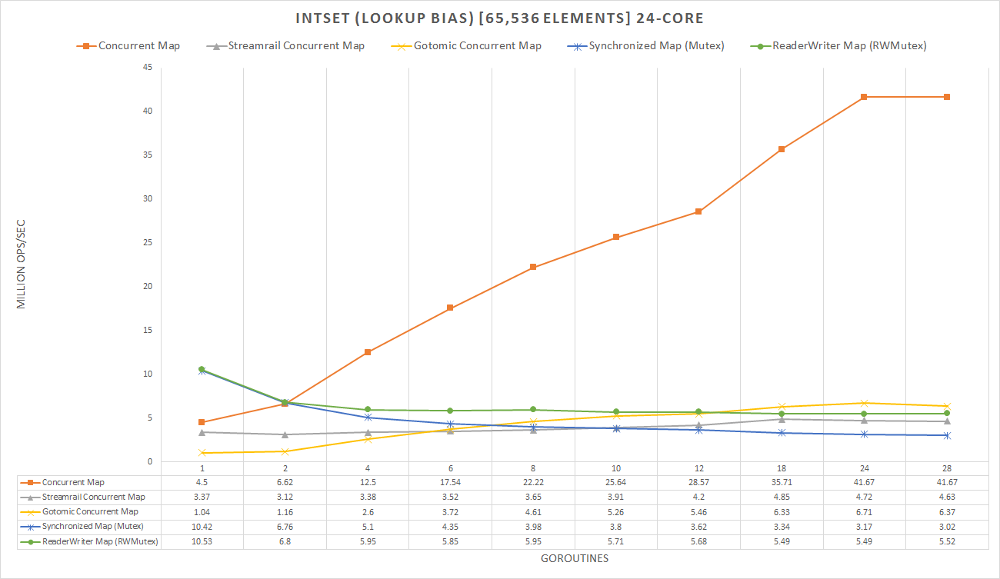
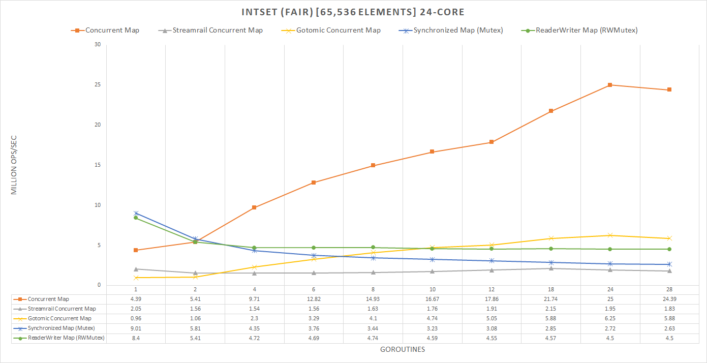
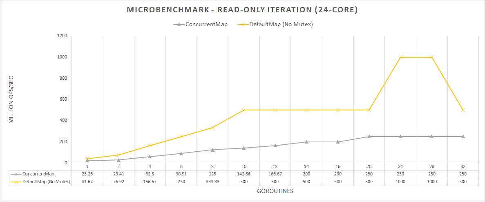
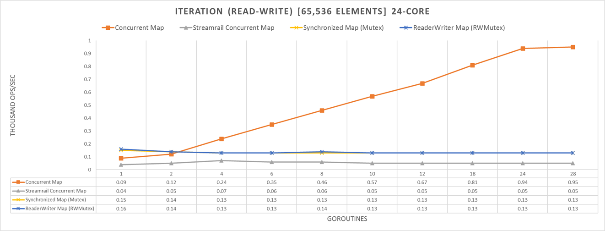
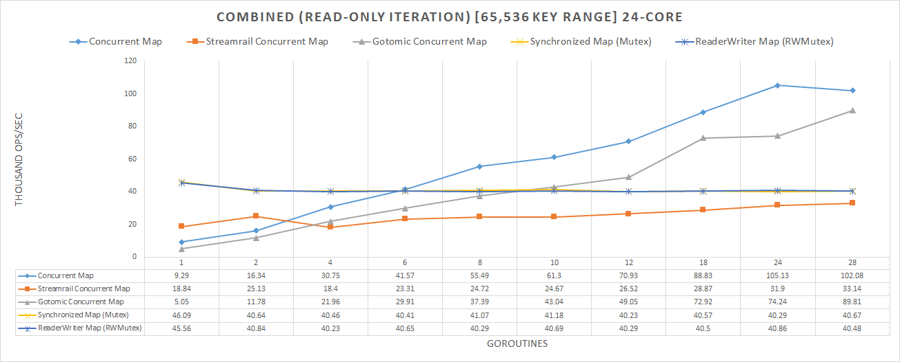
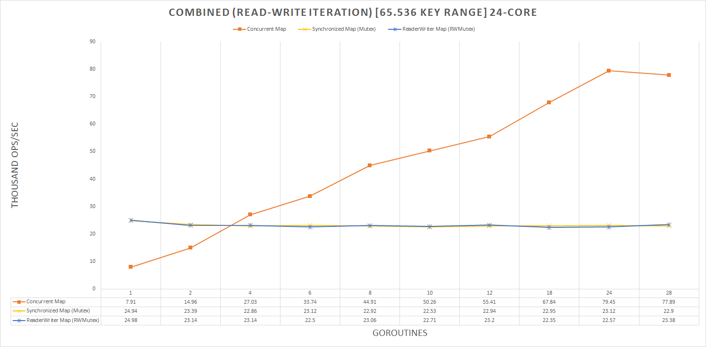

# Concurrent Map Built-in for the Go Programming Language

## Why

This fork of the Go programming language solves a problem which the developers seek to ignore. Whether it be from laziness, a design decision, or it being deemed an impossibilty,
for my academic research, I decided to solve this problem by tackling it head-on. The end result was a very, VERY high performance data structure which offered great utility,
and is implemented in such a way that it is not only backwards compatible, but also compatible with the normal Go map syntax.

## Progress

Now, as mentioned above, it originally was for academic research, hence I am the sole developer for this project. With this being the case, one person can only do so much, but, not
to toot my own horn, I have done alot. Below you will see the current progress of the project in terms of what the map currently supports. It is segmented into the following
sections...

1. Core: This is what the data structure MUST support to even be remotely viable for public use.
2. Sane: This is what the data structure SHOULD support to allow sane and reasonable usage.
3. Nicety: This what the data structure COULD support, and would be nice additions.

### Core

The backbone of any map; the operations it supports. Any and all maps, especially for compatibility with Go, NEED to support
insert, lookup, removal, and of course, iteration. The below denotes the current status of the map in terms of completion. Keep in
mind, for a concurrent map, this also includes the guarantee that these operations are fully atomic. Note that for these to pass, they
MUST support the same syntax as Go's normal map.

- [x] Insertion
- [x] Lookup
- [x] Removal
- [x] Iteration

### Sane

The most sane semantic that SHOULD be offered is the mutual exclusion of elements beyond a single operation. For reference, without this even something as simple
as an increment (as basic of a Read-Modify-Write operation as you can get) are 3 distinct operations, two of which access the map. This is provided through the
`sync.Interlocked(map, key)` function.

- [x] Single Key Mutual Access
- [ ] Multi Key Mutual Access

Note:

Multi Key Mutual Access CAN be supported, but due to time constraints, it will not be implemented in time. To support this, we must extend the above mentioned function
to be variadic, (e.g., `sync.Interlocked(map, key...)`). From here, we may provide a global locking order of which all concurrent multi key mutual access must adhere to
to prevent deadlock. The currently planned implementation is to order each key by the position they hash to, and acquire them (recursively) in that order.
(e.g, Order by hash(key) % size and do this for whatever keys hash to the same bucket recursively).

### Nicety

For true Go compatibility, the ability to use reflection on the concurrent map, while not a necessity, is a nicety. This does not only include adding support for the concurrent map in
terms of it's underlying type (I.E, a way to determine, reflectively, if a map is concurrent or not), but also support for core functions (I.E, printing a concurrent map).

- [ ] Reflection

Note:

Unfortunately, this has not been done, and truthfully, I doubt it will be (by me anyway), as the map, as is, is enough to demonstrate it's uses. Currently, you cannot even print out the map
while it is being modified due to the implementation (thanks to Go's minimalism) does not use a conventional for loop, but instead calls the `mapiternext` function directly. While this is
a very simple fix, I don't feel up to it.

## Usage

### Creation

How does one create the concurrent map? 'make' has been modified to accept a third argument
for creating a map. Previously, the first argument declared the type of the map, and the
second argument was a hint to the runtime for how many buckets it should prepare in advance.

Now there is a third argument, which is the 'concurrency level', wherein this is the number of
Goroutines that are expected to navigate the map. Just like how 'make' normally works, if the
second or third arguments are left out, they are replaced with '0' in the compiler. If 'concurrency level'
is '0', then it will create a normal hashmap. If concurrency > 0, then it will create an concurrent map.

```go
cmap := make(map[int]int, NUM_ELEMS, NUM_CONCURRENCY)
```

### Compatibility

The way Go works is that a hash map, I.E `map[int]int`, it's type is managed by the compiler, and
the actual object itself is just the header for the map. This header is opaque enough that we can modify
it without effecting the user's code, and hence the concurrent map can be used wherever the normal hash map can be.

For example...

```go
func fn(m map[int]int) {
	// Supports Insertion...
	m[k] = v
	// Supports Lookup...
	v = m[k]
	// Supports Removal...
	delete(m, k)
	// Supports iteration...
	for k, v := range m {
		k++
		v++
	}
}

func main() {
	// Declare map
	var m map[int]int
	
	// Default map
	m = make(map[int]int, NUM_ELEMS)
	// Pass default map
	fn(m)

	// Concurrent map
	m = make(map[int]int, NUM_ELEMS, NUM_CONCURRENCY)
	// Pass concurrent map
	fn(m)
}
```

### Atomicity

All accesses to the map are guaranteed to be atomic, in repect to that operation (insert, lookup, and removal).
Atomicity is extremely important in concurrent data structures, and synchronization is allowed through the usage
of internal spinlocks that are coupled to each bucket. While a Goroutine holds a bucket, it's access is
guaranteed to be atomic and synchronized.

```go
// Assignment or update will not overlap with another operation.
map[key] = value
// Lookup will safely yield correct result.
value := map[key]
// Removal will safely leave the map in a well-defined state.
delete(map, key)
```

### Read-Modify-Write

The API exposes the internal locking mechanism to the user to allow for prolonged access to individual elements.
It is exposed through two new additions to the `sync` package, named `Interlocked` and `Release`. This allows the
user to form a single-element mutex, but also forces the user to ONLY have access to that one element so long as
that lock is held. Note that the release can also be deferred.

```go
// Acquire lock on key.
sync.Interlocked(map, key)
// Atomically determine if the object is present, and perform some well-informed decision on it.
if obj, isPresent := map[key]; isPresent {
	update(obj)
} else {
	map[key] = NewObj()
}
// Release lock on current key
sync.Release(map)
```

 As mentioned above, you may defer the release of the lock.

 ```go
 defer sync.Release(map)
 ```

Notice as well that `sync.Release` does not require the key as well; this is because it keeps track of the
current key interlocked for you. With that said, there is a special invariant that will be brought up later.

### Iteration

The map supports iteration that is not only scalable, but guarantees a very strong guarantee that you retain mutual
exclusion so long as you are iterating over it. In consequence, since you only ever hold the lock on that element,
and ONLY that element, it allows concurrent operations to occur while you are iterating (e.g., you may have other
inserts, lookups, removals, and even iterations occuring in parallel/concurrently).

As well, iteration is handled in an elegant way in that iterators will skip over any locked buckets (eliminating
lock convoying) to be processed later.

#### Bug

Unfortunately, if the user breaks from the loop early, it leaves the map in an inconsistent state... that is, since you hold the lock
on that bucket, and it is only ever unlocked after it finishes processing that bucket, returning, breaking, or jumping out of the loop
can cause deadlocks. This can be a very easy fix by looking for any such unconditional jumps and implementing some kind of
function to cleanup the state.

However, in the meantime, the user may call `sync.Release(map)` if they need to do so. Note that, unfortunately, it will also leave
the map in an inconsistent state if the user had deleted other items prior to making any unconditional jump... Again, this can be fixed,
but will not be by me due to time constraints.

### Invariant: One-Key-Per-Goroutine

This invariant must ALWAYS hold: Only one Goroutine may hold a lock at any given time. This is
to prevent deadlocks from occuring, as well as for simplicity. If you attempt to access another key
while one is interlocked (either with `sync.Interlocked` or during iteration) it will result in a panic.

Note:

There is a way around this, and it is rather simple...

If it is important to the user that they be able to access other buckets, then in the future there will
be the ability to interlock multiple keys, however iteration will never allow this.

A clever way to read 'One-Key-Per-Goroutine' is that while only one Goroutine may have a key,
you can still spawn another to access the map for you.

```go
for key, value := range cmap {
	go func(key, value int) {
		cmap[key] = value
	}(key+1, value+1)
}
```

Note that this is deadlock free... even if the spawned Goroutine's key is held in the bucket we are currently iterating over,
they will just be blocking on us (meaning, it is NOT SAFE to block on a spawned child accessing the map).
Unfortunately, this invariant is something which is mandatory and cannot be side-stepped further without invoking deadlocks.

## Performance

### Default Map vs Concurrent Map

The default map, while very well optimized, is not concurrent safe, and so, does not scale well
at all when it can be mutated at any time. Reader-Writer locks also do not help the issue where you
have large amounts of writers, and simple Mutexes limit all access to a single Goroutine, while the
concurrent map allows as many as possible.

The default map is faster for single-Goroutine access, such as if a mutex is not needed, however, the Concurrent Map
scales extremely well and wins out at a breakpoint of 2 Goroutines. This means that, if you ever need a mutex, then
the concurrent map wins out.

For raw insert, lookup, and removal the concurrent map is about 6 - 7x faster (on the hardware tested on).
For read-write iteration, wherein the map can be mutated and a lock is needed to iterate the map, the
concurrent map is about 8 - 9x faster. When you can have operations combined, it goes up to about 9 - 10x.

While the concurrent map does have limitations due to it's invariant, it is extremely useful.

### Concurrent Map vs Others

The two most interesting attempts at providing a concurrent map was Streamrail's and Gotomic's. While it is clear
that Streamrail fails to compete with our map, Gotomic does make a promising competitor. This is because it is an
implementation of the Split Ordered List Hash Table, which is a lock-free implementation. While it does not support
proper Read-Write iteration, it was an interesting contendor, and is faster in some cases where there are a low amount
of elements, but loses in majority of others. 

P.S: This is a temporary README, don't expect it to look good yet.

## Benchmarks & Results

### Intset

Integer set tests insert, lookup, and removal being done by multiple Goroutines. Performance measurements are 
taken in the amount of work being done in terms of how much time it takes to complete.

#### 80/10/10 Lookup/Insert/Remove



#### 34/33/33 Lookup/Insert/Remove



### Iteration

#### Read-Only

Tests raw iteration without the need for a lock. This demonstrates that the concurrent map is, in fact, slower
than an unsynchronized map. This is an unfair test, however, as the concurrent map is lock-based, and so
it could never directly compete, however for credibility sake, we shows the ups and downs of the map.



#### Read-Write

Tests iteration wherein you can have mutations to the map. This also tests mutations of the current key itself, and demonstrates
the ability of fast-pathing when accessing the map (on the key being iterated over) while iterating.




### Combined

Tests all operations (insert, lookup, removal, and iteration), and shows the true scalability of the concurrent map.
Note that, with a mutex, one must acquire it just to complete any one of these operations, while the concurrent map
can freely do all of these operations safely.

#### Read-Only Iteration



#### Read-Write Iteration

