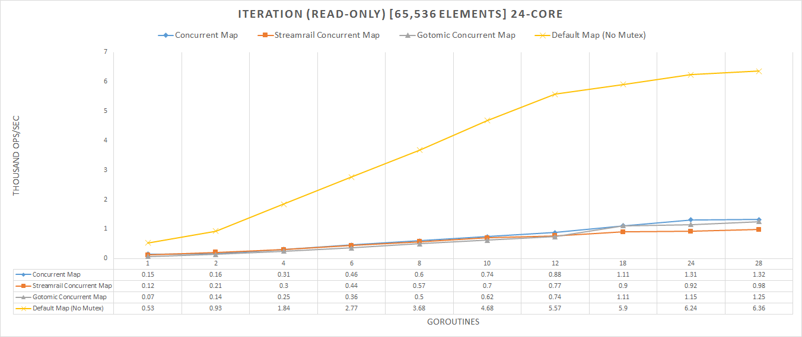

# What is this?

A fork of the Go programming language, with a new and powerful built-in concurrent map type. The fork provides a very scalable and concurrent lock-based hash table with relatively sane semantics. 

# Usage

## Creation

How does one create the concurrent map? 'make' has been modified to accept a third argument
for creating a map. Previously, the first argument declared the type of the map, and the
second argument was a hint to the runtime for how many buckets it should prepare in advance.

Now there is a third argument, which is the 'concurrency level', wherein this is the number of
Goroutines that are expected to navigate the map. Just like how 'make' normally works, if the
second or third arguments are left out, they are replaced with '0' in the compiler. If 'concurrency level'
is '0', then it will create a normal hashmap. If concurrency > 0, then it will create an concurrent map.

## Compatibility

The way Go works is that a hash map, I.E 'map[int]int', it's type is managed by the compiler, and
the actual object itself is just the header for the map. This header is opaque enough that we can modify
it without effecting the user's code, and hence the concurrent map can be used wherever the normal hash map can be.

For example...

```go
func fn(m map[int]int) {
	m[k] = v
}

func main() {
	// Default map
	hmap := make(map[int]int, NUM_ELEMS)
	// Concurrent map
	cmap := make(map[int]int, NUM_ELEMS, NUM_CONCURRENCY)
	// Valid
	fn(hmap)
	// Also valid; the types are the same, but the header keeps track of if it is concurrent or not.
	fn(cmap)
}
```

## Atomicity

All accesses to the map are guaranteed to be atomic, in repect to that operation. 
That means map assignments, accesses, and deleting from the map are guaranteed to be atomic in respect to the operation itself. 
Read-Modify-Write operations will be discussed below.

Atomicity is extremely important in concurrent data structures, and synchronization is allowed through
the usage of internal spinlocks that are coupled to each bucket. While a Goroutine holds a bucket,
it's access is guaranteed to be atomic and synchronized.

```go 
// Map Assignments
map[key] = value
// Map Accesses
value := map[key]
// Map Deletion
delete(map, key)
```

The above pseudocode is also compatible with the concurrent map.

### Read-Modify-Write

The API allows the user to synchronize, or 'interlock' access to a requested key. The user must
specify the key to be acquired, upon which it is created if it hasn't been already (but disposed of
if not used, or is deleted), and all accesses to that key (and the bucket that holds it) are
atomic. This is similar to a normal mutex, in that it does not lock the entire map, but merely one
portion of the bucket.

```go
// Acquire
sync.Interlocked(map, key)
map[key] = value
// Release
sync.Release(map)
```

Notice above that sync.Release does not require the key as well; this is because it keeps track of the
current key interlocked for you. With that said, there is a special invariant that will be brought up later.

### Iteration

The concurrent map allows iteration to be on-going while the map is being mutated. This is due to
the map being lock-based, and comes in our favor. While iterating the map, not only can it be mutated,
but the bucket you are on is owned you as well; you have atomic access to that bucket at all times until
released.

I must also warn, that currently, jumping out of a loop will leave the map in an inconsistent state, and
is being worked on, however in the meantime one can use `sync.Release(map)` before returning or breaking.

Iteration is done by doing a `for range` loop.

### Invariant: One-Key-Per-Goroutine

This invariant must ALWAYS hold: Only one Goroutine may hold a key at any given time. This is
to prevent deadlocks from occuring, as well as for simplicity. If you attempt to access another key
while one is interlocked (either with sync.Interlocked or during iteration) it will panic.

#### Work Around

If it is important to the user that they be able to access other buckets, then in the future there will
be the ability to interlock multiple keys, however iteration will never allow this.

A clever way to read 'One-Key-Per-Goroutine' is that while only one Goroutine may have a key,
you can still spawn another to access the map for you.

```go
for key, value := range cmap {
	someOtherKey := value.acquireOtherKey()
	go func() { 
		m[someOtherKey] = value.otherValue()
		}()
}
```

Unfortunately, this invariant is something which is mandatory and cannot be side-stepped further without invoking
deadlocks.


## Concurrency & Parallelism

The data structure allows for true parallelism, so long as the keys being accessed do not hash to
a bucket currently owned by another Goroutine. Due to the way the map is structured, the chances of
two keys hashing to the same bucket is extremely low, and hence scales well. Optimizations that help
prevent the drastic effects of lock convoying, improve cache coherency, fast-path access to key-values, 
and others have been employed to ensure that concurrency remains at it's peak.

## Performance: Default Map vs Concurrent Map

The default map, while very well optimized, is not concurrent safe, and so, does not scale well
at all when it can be mutated at any time. Reader-Writer locks also do not help the issue where you
have large amounts of writers, and simple Mutexes limit all access to a single Goroutine, while the
concurrent map allows as many as possible.

The default map is faster for single-Goroutine access, such as if a mutex is not needed, however, the Concurrent Map
scales extremely well and wins out at a breakpoint of 2 Goroutines. This means that, if you ever need a mutex, then
the concurrent map wins out.

For raw insert, lookup, and removal the concurrent map is about 6 - 7x faster (on the hardware tested on).
For read-write iteration, wherein the map can be mutated and a lock is needed to iterate the map, the
concurrent map is about 8 - 9x faster. When you can have operations combined, it goes up to about 9 - 10x.

While the concurrent map does have limitations due to it's invariant, it is extremely useful.

### Benchmark Results

#### Intset

Integer set tests insert, lookup, and removal being done by multiple Goroutines. Performance measurements are 
taken in the amount of work being done in terms of how much time it takes to complete.


#### Read-Only Iteration

Tests raw iteration without the need for a lock. This demonstrates that the concurrent map is, in fact, slower
than an unsynchronized map. This is an unfair test, however, as the concurrent map is lock-based, and so
it could never directly compete, however for credibility sake, we shows the ups and downs of the map.



#### Read-Write Iteration

Tests iteration wherein you can have mutations to the map. This also tests mutations of the current key itself, and demonstrates
the ability of fast-pathing when accessing the map (on the key being iterated over) while iterating.


#### Combined

Tests all operations (insert, lookup, removal, and iteration), and shows the true scalability of the concurrent map.
Note that, with a mutex, one must acquire it just to complete any one of these operations, while the concurrent map
can freely do all of these operations safely.

